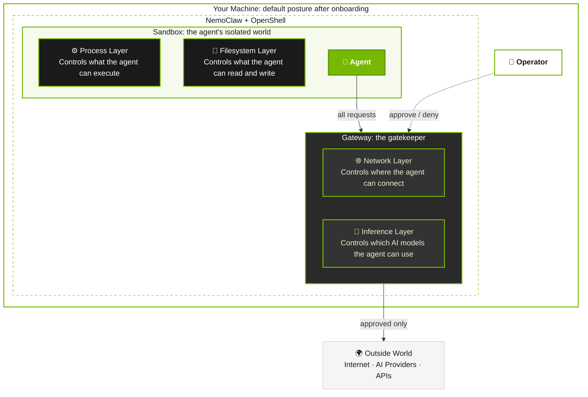

import { AgentOnly } from "../_components/AgentGuide";

NemoClaw ships with deny-by-default security controls across four layers: network, filesystem, process, and inference.
You can tune every control, but each change shifts the risk profile.
This page documents each configurable control, its default, what it protects, the concrete risk of relaxing it, and a recommendation for common use cases.

For background on how the layers fit together, refer to [How It Works](../about/how-it-works).

{/* TODO: uncomment after the OpenShell docs are published
<Note>
OpenShell enforces the platform-level mechanisms that NemoClaw configures, including network namespace isolation, seccomp filters, SSRF protection, TLS termination, and gateway authentication.
For the full platform-level controls reference, see [OpenShell Security Best Practices](https://docs.nvidia.com/openshell/latest/security/best-practices.html).
</Note>
*/}

## Protection Layers at a Glance

NemoClaw enforces security at four layers.
NemoClaw locks some controls when it creates the sandbox and requires a restart to change them.
You can hot-reload others while the sandbox runs.

The following diagram shows the default posture immediately after onboarding, before you approve any endpoints or apply any presets.

| Layer | What it protects | Enforcement point | Changeable at runtime |
| --- | --- | --- | --- |
| Network | Unauthorized outbound connections and data exfiltration. | OpenShell gateway | Yes. Use `openshell policy set` or operator approval. |
| Filesystem | System binary tampering, credential theft, config manipulation. | Landlock LSM + container mounts | Landlock layout: no. Requires sandbox re-creation. Use host-side NemoClaw commands for durable config changes. |
| Process | Privilege escalation, fork bombs, syscall abuse. | Container runtime (Docker/K8s `securityContext`) | No. Requires sandbox re-creation. |
| Inference | Credential exposure, unauthorized model access, cost overruns. | OpenShell gateway | Yes. Use the NemoClaw inference switching command. |

## Network Controls

NemoClaw controls which hosts, ports, and HTTP methods the sandbox can reach, and lets operators approve or deny requests in real time.

{/* OpenShell provides additional network enforcement mechanisms not covered here, including network namespace isolation, SSRF protection, TLS auto-detection and termination, and audit-vs-enforce modes.
See the [Network Controls](https://docs.nvidia.com/openshell/latest/security/best-practices.html#network-controls) section of the OpenShell Security Best Practices. */}

### Deny-by-Default Egress

The sandbox blocks all outbound connections unless you explicitly list the endpoint in the applicable baseline policy files.

| Aspect | Detail |
|---|---|
| Default | All egress denied. Only endpoints in the baseline policy can receive traffic. |
| What you can change | Add endpoints to the policy file (static) or with `openshell policy set` (dynamic). |
| Risk if relaxed | Each allowed endpoint is a potential data exfiltration path. The agent can send workspace content, credentials, or conversation history to any reachable host. |
| Recommendation | Add only endpoints the agent needs for its task. Prefer operator approval for one-off requests over permanently widening the baseline. |

### Binary-Scoped Endpoint Rules

Each network policy entry restricts which executables can reach the endpoint using the `binaries` field.

OpenShell identifies the calling binary by reading `/proc/<pid>/exe` (the kernel-trusted executable path, not `argv[0]`), walking the process tree for ancestor binaries, and computing a SHA256 hash of each binary on first use.
If someone replaces a binary while the sandbox runs, the hash mismatch immediately denies the request.

| Aspect | Detail |
|---|---|
| Default | Each endpoint restricts access to specific binaries. For example, the `github` preset restricts access so only `/usr/bin/git` can reach `github.com`. Binary paths support glob patterns (`*` matches one path component, `**` matches recursively). |
| What you can change | Add binaries to an endpoint entry, or omit the `binaries` field to allow any executable. |
| Risk if relaxed | Removing binary restrictions lets any process in the sandbox reach the endpoint. An agent could use `curl`, `wget`, or a Python script to exfiltrate data to an allowed host, bypassing the intended usage pattern. |
| Recommendation | Always scope endpoints to the binaries that need them. If the agent needs a host from a new binary, add that binary explicitly rather than removing the restriction. |

### Path-Scoped HTTP Rules

Endpoint rules restrict allowed HTTP methods and URL paths.

| Aspect | Detail |
|---|---|
| Default | Some endpoints allow GET and POST on `/**` (for example, `clawhub.ai`). Others restrict methods and paths to specific API routes (for example, `integrate.api.nvidia.com` allows POST only to inference and embedding paths and GET to model listings). Read-only endpoints such as `docs.openclaw.ai`, the `npm_registry` baseline entry, and the `pypi` preset allow GET only (PyPI also allows HEAD). The `npm` preset is an intentional exception: npm/Yarn registry traffic uses L4 pass-through for Node 22 undici CONNECT compatibility. |
| What you can change | Add methods (PUT, DELETE, PATCH) or restrict paths to specific prefixes. |
| Risk if relaxed | Allowing all methods on an API endpoint gives the agent write and delete access. For example, allowing DELETE on `api.github.com` lets the agent delete repositories. |
| Recommendation | Use GET-only rules for endpoints that the agent only reads. Add write methods only for endpoints where the agent must create or modify resources. Restrict paths to specific API routes when possible. |

### L4-Only vs L7 Inspection (`protocol` Field)

All sandbox egress goes through OpenShell's CONNECT proxy.
The `protocol` field on an endpoint controls whether the proxy also inspects individual HTTP requests inside the tunnel.

| Aspect | Detail |
|---|---|
| Default | Endpoints without a `protocol` field use L4-only enforcement: the proxy checks host, port, and binary identity, then relays the TCP stream without inspecting payloads. Setting `protocol: rest` enables L7 inspection: the proxy auto-detects and terminates TLS, then evaluates each HTTP request's method and path against the endpoint's `rules` or `access` preset. |
| What you can change | Add `protocol: rest` to an endpoint to enable per-request HTTP inspection. Use the `access` preset (`full`, `read-only`, `read-write`) or explicit `rules` to control allowed methods and paths. |
| Risk if relaxed | L4-only endpoints (no `protocol` field) allow the agent to send any data through the tunnel after the initial connection is permitted. The proxy cannot see or filter the HTTP method, path, or body. The `access: full` preset with `protocol: rest` enables inspection but allows all methods and paths, so it does not restrict what the agent can do at the HTTP level. |
| Recommendation | Use `protocol: rest` with specific `rules` for REST APIs where you want method and path control. Use `protocol: rest` with `access: read-only` for read-only endpoints. Omit `protocol` only for non-HTTP protocols (WebSocket, gRPC streaming), endpoints that do not need HTTP inspection, or documented compatibility exceptions that require a client-managed CONNECT tunnel. |

### Operator Approval Flow

When the agent reaches an unlisted endpoint, OpenShell blocks the request and prompts you in the TUI.

| Aspect | Detail |
|---|---|
| Default | Enabled. The gateway blocks all unlisted endpoints and requires approval. |
| What you can change | The system merges approved endpoints into the sandbox's policy as a new durable revision. They persist across sandbox restarts within the same sandbox instance. However, when you destroy and recreate the sandbox through onboarding, the policy resets to the baseline defined in the blueprint. |
| Risk if relaxed | Approving an endpoint permanently widens the running sandbox's policy. If you approve a broad domain (such as a CDN that hosts arbitrary content), the agent can fetch anything from that domain until you destroy and recreate the sandbox. |
| Recommendation | Review each blocked request before approving. If you find yourself approving the same endpoint repeatedly, add it to the baseline policy with appropriate binary and path restrictions. To reset approved endpoints, destroy and recreate the sandbox. |

### Policy Presets

NemoClaw ships preset policy files in `nemoclaw-blueprint/policies/presets/` for common integrations.

| Preset | What it enables | Key risk |
|---|---|---|
| `brave` | Brave Search API. | Agent can issue search queries. |
| `brew` | Homebrew (Linuxbrew) package manager. The sandbox base image includes the `brew` binary; this preset opens network egress to GitHub and the Homebrew formulae index so `brew install` can fetch bottles. | Allows installing arbitrary Homebrew packages, which may contain malicious code. |
| `claude-code` | Claude Code CLI API, telemetry, and crash-report endpoints. | Allows a separately installed Claude Code CLI to reach Anthropic and telemetry hosts with its own credentials. Do not use this preset for NemoClaw inference routing. |
| `discord` | Discord REST API, WebSocket gateway, CDN. | CDN endpoint (`cdn.discordapp.com`) allows GET to any path. WebSocket uses `access: full` (no inspection). |
| `github` | GitHub and GitHub REST API. | Gives agent read/write access to repositories and issues via `git`. |
| `huggingface` | Hugging Face Hub (download-only) and inference router. | Allows downloading arbitrary models and datasets. POST is restricted to the inference router only. |
| `jira` | Atlassian Jira API. | Gives agent read/write access to project issues and comments. |
| `local-inference` | Local Ollama and vLLM through the host gateway. | Allows sandbox access to host-side local inference ports covered by the preset. |
| `npm` | npm and Yarn registries via L4 pass-through. | Allows installing arbitrary npm packages, which may contain malicious code. OpenShell still gates by host, port, and binary, but does not inspect HTTP method, path, or body for this preset. |
| `outlook` | Microsoft 365, Outlook. | Gives agent access to email. |
| `pypi` | Python Package Index (GET and HEAD only). | Allows installing arbitrary Python packages, which may contain malicious code. Publishing is blocked. |
| `slack` | Slack API, Socket Mode, webhooks. | WebSocket uses `access: full`. Agent can post to any channel the bot token has access to. |
| `telegram` | Telegram Bot API. | Agent can send messages to any chat the bot token has access to. |

**Recommendation:** Apply presets only when the agent's task requires the integration. Review the preset's YAML file before applying to understand the endpoints, methods, and binary restrictions it adds.

## Filesystem Controls

NemoClaw restricts which paths the agent can read and write, protecting system binaries, configuration files, and gateway credentials.

{/* OpenShell covers additional filesystem enforcement details, including `hard_requirement` compatibility mode for Landlock and policy path validation rules.
See the [Filesystem Controls](https://docs.nvidia.com/openshell/latest/security/best-practices.html#filesystem-controls) section of the OpenShell Security Best Practices. */}

### Read-Only System Paths

The container mounts system directories read-only to prevent the agent from modifying binaries, libraries, or configuration files.

| Aspect | Detail |
|---|---|
| Default | `/usr`, `/lib`, `/proc`, `/dev/urandom`, `/app`, `/etc`, `/var/log` are read-only. |
| What you can change | Add or remove paths in the `filesystem_policy.read_only` section of the policy file. |
| Risk if relaxed | Making `/usr` or `/lib` writable lets the agent replace system binaries (such as `curl` or `node`) with trojanized versions. Making `/etc` writable lets the agent modify DNS resolution, TLS trust stores, or user accounts. |
| Recommendation | Never make system paths writable. If the agent needs a writable location for generated files, use a subdirectory of `/sandbox`. |

### Agent Config Directory

<AgentOnly variant="openclaw">

The `/sandbox/.openclaw` directory contains the OpenClaw gateway configuration (model routing, CORS settings, channel config).
The current entrypoint reads the gateway auth token from OpenClaw config when present, exports it as `OPENCLAW_GATEWAY_TOKEN`, and writes it to `/tmp/nemoclaw-proxy-env.sh` so interactive sandbox sessions can reach the gateway through system-wide shell hooks.
In root mode, the gateway process still runs as the separate `gateway` user, but the token is intentionally available to sandbox shells for local gateway access.

Writable agent state such as plugins, skills, hooks, and workspace metadata lives directly under `/sandbox/.openclaw`.

By default, this directory starts writable so the agent can manage its own config, install skills, and write to standard home-directory paths natively.
For sensitive workloads, use a reviewed host-side immutability workflow after initial setup so the sandbox user cannot change config and high-risk state entry points.
The immutability workflow locks high-risk state directories (`skills`, `hooks`, `cron`, `agents`, `extensions`, `plugins`, `workspace`, `memory`, `devices`, `canvas`, `telegram`, `wechat`, `whatsapp`, `platforms`, `weixin`, `profiles`, `skins`) to `root:sandbox` with `chmod -R go-w`.
The OpenClaw gateway (a member of the `sandbox` group) keeps read access to plugin and agent code; the sandbox user can no longer write them.
The same workflow also locks the secret-bearing directories (`credentials`, `identity`, `pairing`) to `root:root 700` with `chmod -R go-rwX`.
Neither the sandbox user nor the gateway can read those secrets while the lock is active.
Restoring the mutable-default posture returns both groups to `sandbox:sandbox 2770`.
The list is the union of state directories declared by every shipped agent manifest; the lock helper silently skips dirs that aren't present in a given agent's config tree.
Two exemption kinds keep runtime data writable.
The lock inventory omits top-level Hermes runtime dirs (`sessions/`, `memories/`, `logs/`, `cache/`, `plans/`) and the image-build-regenerated `openclaw-weixin/`; the lock helper never touches those paths.
Inside a locked tree, the helper restores `agents/<agent-id>/sessions/` to `sandbox:sandbox 2770` after the surrounding `agents/` lock so the OpenClaw TUI can create and write session metadata under an otherwise root-owned parent.
If any high-risk state-dir root is a symlink when the lock runs, the lock helper refuses to proceed and reports "Config not locked: state dir root is a symlink" instead of following the link with privileged `chown -R` / `chmod -R`.

- **DAC permissions (default).** The sandbox user owns `/sandbox/.openclaw` with mode `2770` (setgid `sandbox:sandbox`) and `openclaw.json` with mode `660`, so the agent and its group can read and write config directly. A reviewed host-side immutability workflow should compare the intended ownership and mode with the live sandbox filesystem before treating the config tree as locked.
- **Config integrity hash.** The image includes a SHA256 hash of `openclaw.json`. In the default mutable state, `.config-hash` is sandbox-owned and is not a tamper-proof trust anchor, so startup does not fail closed on that hash. When the hash is root-owned and read-only, startup enforces it and refuses to start if the hash does not match.
- **Content integrity seal.**
  A clean immutable config lock can capture a SHA-256 seal of `openclaw.json` and other locked files into host-side state.
  Verification recomputes hashes inside the sandbox and surfaces drift on mismatch, so a host-root tamper that flips permissions back to `444 root:root` after rewriting the file is still flagged.
  Sandboxes locked before the seal landed have no recorded hash; permission-only verification cannot prove their bytes match the image original, so the seal is **not** a retroactive proof of integrity for legacy state.
  The same limitation applies when the locked file set grew after the existing seal was captured.
  Rebuild the sandbox for a known-good baseline before trusting a new seal.
- **Gateway token environment.** The gateway exports `OPENCLAW_GATEWAY_TOKEN` and writes it to `/tmp/nemoclaw-proxy-env.sh` for interactive sandbox sessions. Keep this in mind when deciding whether a workload should run with mutable config or an immutable config posture.

| Aspect | Detail |
|---|---|
| Default | The sandbox keeps `/sandbox/.openclaw` writable (`2770 sandbox:sandbox`), sets `openclaw.json` to `660 sandbox:sandbox`, lets the agent manage state directly, and has the gateway place `OPENCLAW_GATEWAY_TOKEN` in `/tmp/nemoclaw-proxy-env.sh` for interactive shells. |
| What you can change | Apply a reviewed host-side immutability workflow to lock config and state directories with DAC permissions and the immutable flag where available. |
| Risk of default | A writable `.openclaw` directory lets the agent modify its own gateway config: disabling CORS or redirecting inference to an attacker-controlled endpoint. |
| Recommendation | For always-on assistants handling sensitive workloads, lock config after initial setup. For development workflows, the writable default is appropriate. |

</AgentOnly>
<AgentOnly variant="hermes">

The `/sandbox/.hermes` directory contains Hermes runtime configuration, generated environment settings, logs, platform state, and durable database state.
NemoClaw writes `config.yaml` and `.env` during onboarding and rebuilds.
Direct edits to these files can be overwritten when NemoClaw regenerates the image.

Hermes also stores runtime state such as `state.db`, logs, and platform sessions under the `.hermes` tree.
Messaging sessions such as WhatsApp pairing can remain mutable by design so they survive rebuilds.

| Aspect | Detail |
|---|---|
| Default | The Hermes config tree contains NemoClaw-generated config plus mutable runtime state. |
| What you can change | Use host-side NemoClaw commands for durable model, provider, messaging, and policy changes; inspect files directly only for debugging. |
| Risk of direct edits | Direct edits to generated config can drift from the host registry and may be lost on rebuild. |
| Recommendation | For sensitive workloads, keep generated config under NemoClaw control and back up Hermes state before destructive operations. |

</AgentOnly>

### Writable Paths

The agent has read-write access to `/sandbox`, `/tmp`, and `/dev/null`.

| Aspect | Detail |
|---|---|
| Default | `/sandbox` (agent workspace), `/tmp` (temporary files), `/dev/null`. |
| What you can change | Add additional writable paths in `filesystem_policy.read_write`. |
| Risk if relaxed | Each additional writable path expands the agent's ability to persist data and potentially modify system behavior. Adding `/var` lets the agent write to log directories. Adding `/home` gives access to other user directories. |
| Recommendation | Keep writable paths to `/sandbox` and `/tmp`. If the agent needs a persistent working directory, create a subdirectory under `/sandbox`. |

### Landlock LSM Enforcement

Landlock is a Linux Security Module that enforces filesystem access rules at the kernel level.

| Aspect | Detail |
|---|---|
| Default | `compatibility: best_effort`. The entrypoint applies Landlock rules when the kernel supports them and silently skips them on older kernels. |
| What you can change | This is a NemoClaw default, not a user-facing knob. |
| Risk if relaxed | On kernels without Landlock support (pre-5.13), filesystem restrictions rely solely on container mount configuration, which is less granular. |
| Recommendation | Run on a kernel that supports Landlock (5.13+). Ubuntu 22.04 LTS and later include Landlock support. |

## Process Controls

NemoClaw limits the capabilities, user privileges, and resource quotas available to processes inside the sandbox.

{/* OpenShell enforces additional process-level controls not covered here, including seccomp BPF socket domain filters and a specific enforcement application order (namespace entry, privilege drop, Landlock, seccomp).
See the [Process Controls](https://docs.nvidia.com/openshell/latest/security/best-practices.html#process-controls) section of the OpenShell Security Best Practices. */}

### Capability Drops

The entrypoint drops dangerous Linux capabilities from the bounding set at startup using `capsh`.
This limits what capabilities any child process (gateway, sandbox, agent) can ever acquire.
When the entrypoint switches from root to the `sandbox` and `gateway` users, it uses `setpriv` when available to remove the remaining privilege-separation capabilities from the child process at the same time as the user change.

The initial entrypoint drop removes `cap_sys_admin`, `cap_sys_ptrace`, `cap_net_raw`, `cap_dac_override`, `cap_sys_chroot`, `cap_fsetid`, `cap_setfcap`, `cap_mknod`, `cap_audit_write`, and `cap_net_bind_service`.
During `setpriv` step-down, the child process also loses `cap_setuid`, `cap_setgid`, `cap_fowner`, `cap_chown`, and `cap_kill`.

This behavior is best effort: if `capsh` is not available or `CAP_SETPCAP` is not in the bounding set, the entrypoint logs a warning and continues with the default capability set.
If `setpriv` is unavailable, the entrypoint falls back to `gosu` and logs a warning that the remaining bounding-set capabilities were retained for the child process.

To make the drop fail-closed instead of best-effort, set `NEMOCLAW_REQUIRE_CAP_DROP=1` in the entrypoint environment.
The agent then refuses to start unless the agent process tree's bounding set is verified free of the dangerous capabilities, so it will not boot on a host whose bounding set still holds them — typically one that cannot perform the drop (no `CAP_SETPCAP`, or `capsh` missing) and was not given a clean bounding set by the container runtime.
This is opt-in because such hosts are common (many cloud VMs, Docker Desktop, WSL); leaving it unset preserves the best-effort default.
The check covers the agent process tree only — a `nemoclaw connect` shell is spawned by the container runtime outside that tree and is not affected (tracked in [NVIDIA/OpenShell#1452](https://github.com/NVIDIA/OpenShell/issues/1452)).

For additional protection, pass `--cap-drop=ALL` with `docker run` or Compose (see [Sandbox Hardening](../manage-sandboxes/sandbox-hardening)).

| Aspect | Detail |
|---|---|
| Default | The entrypoint drops dangerous capabilities at startup using `capsh`, then uses `setpriv` during user step-down when possible. Best-effort. |
| What you can change | When launching with `docker run` directly, pass `--cap-drop=ALL --cap-add=NET_BIND_SERVICE` for stricter enforcement. In the standard NemoClaw onboarding flow, the entrypoint handles capability dropping automatically. |
| Risk if relaxed | `CAP_SYS_ADMIN` and `CAP_SYS_PTRACE` expand kernel and process attack surface. `CAP_NET_RAW` allows raw socket access for network sniffing. `CAP_DAC_OVERRIDE` bypasses filesystem permission checks. If `capsh` or `setpriv` cannot run, the container retains more of the runtime-provided capability set. |
| Recommendation | Run on an image that includes `capsh` and `setpriv` (the NemoClaw image includes them). For defense-in-depth, also pass `--cap-drop=ALL` at the container runtime level. |

### Gateway Process Isolation

The in-sandbox gateway runs as a separate `gateway` user, not as the `sandbox` user that runs the agent.

| Aspect | Detail |
|---|---|
| Default | The entrypoint starts the gateway process using `gosu gateway`, isolating it from the agent's `sandbox` user. |
| What you can change | This is not a user-facing knob. The entrypoint enforces it when running as root. In non-root mode (when OpenShell sets `no-new-privileges`), gateway process isolation does not work because `gosu` cannot change users. |
| Risk if relaxed | If the gateway and agent run as the same user, the agent can kill the gateway process and restart it with a tampered configuration (the "fake-HOME" attack). |
| Recommendation | No action needed. The entrypoint handles this automatically. Be aware that non-root mode disables this isolation. |

### No New Privileges

The `no-new-privileges` flag prevents processes from gaining additional privileges through setuid binaries or capability inheritance.

| Aspect | Detail |
|---|---|
| Default | OpenShell sets `PR_SET_NO_NEW_PRIVS` using `prctl()` inside the sandbox process as part of the seccomp filter setup. The NemoClaw Compose example also shows the equivalent `security_opt: no-new-privileges:true` setting. |
| What you can change | OpenShell's seccomp path enforces this inside the sandbox. It is not a user-facing knob. |
| Risk if relaxed | Without this flag, a compromised process could execute a setuid binary to escalate to root inside the container, then attempt container escape techniques. |
| Recommendation | No action needed. OpenShell enforces this automatically when the sandbox network policy is active. This flag prevents `gosu` from switching users, so non-root mode disables gateway process isolation in the NemoClaw entrypoint. |

### Process Limit

A process limit caps the number of processes the sandbox user can spawn.
The entrypoint sets both soft and hard limits using `ulimit -u 512`.
This behavior is best effort: if the container runtime restricts `ulimit` modification, the entrypoint logs a security warning and continues without the limit.

| Aspect | Detail |
|---|---|
| Default | 512 processes (`ulimit -u 512`), best-effort. |
| What you can change | Increase or decrease the limit with `--ulimit nproc=N:N` in `docker run` or the `ulimits` section in Compose. The runtime-level ulimit takes precedence over the entrypoint's setting. |
| Risk if relaxed | Removing or raising the limit makes the sandbox vulnerable to fork-bomb attacks, where a runaway process spawns children until the host runs out of resources. If the entrypoint cannot set the limit (logs `[SECURITY] Could not set soft/hard nproc limit`), the container runs without process limits. |
| Recommendation | Keep the default at 512. If the agent runs workloads that spawn many child processes (such as parallel test runners), increase to 1024 and monitor host resource usage. If the entrypoint logs a warning about ulimit restrictions, set the limit through the container runtime instead. |

### Non-Root User

The sandbox runs agent processes as a dedicated `sandbox` user and group.
The entrypoint starts as root for privilege separation, then drops to the `sandbox` user for all agent commands.

| Aspect | Detail |
|---|---|
| Default | `run_as_user: sandbox`, `run_as_group: sandbox`. A separate `gateway` user runs the gateway process. |
| What you can change | Change the `process` section in the policy file to run as a different user. |
| Risk if relaxed | Running as `root` inside the container gives the agent access to modify any file in the container filesystem and increases the impact of container escape vulnerabilities. |
| Recommendation | Never run as root. Keep the `sandbox` user. |

### PATH Hardening

The entrypoint locks the `PATH` environment variable to system directories, preventing the agent from injecting malicious binaries into command resolution.

| Aspect | Detail |
|---|---|
| Default | The entrypoint sets `PATH` to `/usr/local/sbin:/usr/local/bin:/usr/sbin:/usr/bin:/sbin:/bin` at startup. |
| What you can change | This is not a user-facing knob. The entrypoint enforces it. |
| Risk if relaxed | Without PATH hardening, the agent could create an executable named `curl` or `git` in a writable directory earlier in the PATH, intercepting commands run by the entrypoint or other processes. |
| Recommendation | No action needed. The entrypoint handles this automatically. |

### Build Toolchain Removal

The Dockerfile removes compilers and network probes from the runtime image.

| Aspect | Detail |
|---|---|
| Default | The Dockerfile purges `gcc`, `gcc-12`, `g++`, `g++-12`, `cpp`, `cpp-12`, `make`, `netcat-openbsd`, `netcat-traditional`, and `ncat` from the sandbox image. |
| What you can change | Modify the Dockerfile to keep these tools, or install them at runtime if package manager access is allowed. |
| Risk if relaxed | A compiler lets the agent build arbitrary native code, including kernel exploits or custom network tools. `netcat` enables arbitrary TCP connections that bypass HTTP-level policy enforcement. |
| Recommendation | Keep build tools removed. If the agent needs to compile code, run the build in a separate, purpose-built container and copy artifacts into the sandbox. |

### Image Digest Pinning

The blueprint references the sandbox image by an immutable `@sha256:` digest instead of a mutable tag such as `:latest`.
A registry compromise or accidental force-push cannot silently swap the sandbox image.

| Aspect | Detail |
|---|---|
| Default | `nemoclaw-blueprint/blueprint.yaml` pins the sandbox image by digest. A CI regression test blocks any mutable-tag reference from merging. |
| What you can change | Contributors bumping the sandbox image must update the digest in `blueprint.yaml`. Release tooling should rewrite the digest automatically. |
| Risk if relaxed | Reverting to a mutable tag (`:latest`) allows a registry-side change to replace the sandbox image without any blueprint update, which is a supply-chain risk. |
| Recommendation | Always reference the sandbox image by digest. If you build a custom image with the onboarding `--from` path, the digest constraint does not apply to your local build. |

### Auth Profile Permissions

The entrypoint and migration flows enforce `chmod 600` on all `auth-profiles.json` files under `~/.openclaw`.
This prevents other users on the host from reading stored credentials.

| Aspect | Detail |
|---|---|
| Default | `600` permissions applied recursively at startup and after migration restores. |
| What you can change | This is not a user-facing knob. The entrypoint enforces it. |
| Risk if relaxed | Looser permissions let other users or processes on the host read provider API keys and tokens stored in auth profiles. |
| Recommendation | No action needed. If you see a `permission denied` error when reading auth profiles, verify that you are running as the same user who created them. |

## Gateway Authentication Controls

<AgentOnly variant="openclaw">

The OpenClaw gateway authenticates devices that connect to the Control UI dashboard.
NemoClaw hardens these defaults at image build time.

### Device Authentication

Device authentication requires each connecting device to go through a pairing flow before it can interact with the gateway.

| Aspect | Detail |
|---|---|
| Default | Enabled. The gateway requires device pairing for all connections. |
| What you can change | Set `NEMOCLAW_DISABLE_DEVICE_AUTH=1` as a Docker build argument to disable device authentication. This is a build-time setting baked into `openclaw.json` and verified by hash at startup. |
| Risk if relaxed | Disabling device auth allows any device on the network to connect to the gateway without proving identity. This is dangerous when combined with LAN-bind changes or cloudflared tunnels in remote deployments, resulting in an unauthenticated, publicly reachable dashboard. |
| Recommendation | Keep device auth enabled (the default). Only disable it for headless or development environments where no untrusted devices can reach the gateway. |

### Gateway Bind Address

NemoClaw binds the OpenShell gateway to loopback by default.

| Aspect | Detail |
|---|---|
| Default | `NEMOCLAW_GATEWAY_BIND_ADDRESS=127.0.0.1`. |
| What you can change | Set `NEMOCLAW_GATEWAY_BIND_ADDRESS=0.0.0.0` before onboarding to listen on all IPv4 interfaces. |
| Risk if relaxed | Other hosts on the network may be able to reach the OpenShell gateway. |
| Recommendation | Keep the loopback default unless the gateway must be reachable from another host. |

### Insecure Auth Derivation

The `allowInsecureAuth` setting controls whether the gateway permits non-HTTPS authentication.

| Aspect | Detail |
|---|---|
| Default | Derived from the `CHAT_UI_URL` scheme at build time. When the URL uses `http://` (local development), insecure auth is allowed. When it uses `https://` (remote or production), insecure auth is blocked. |
| What you can change | This is derived automatically from `CHAT_UI_URL`. Set `CHAT_UI_URL` to an `https://` URL to enforce secure auth. |
| Risk if relaxed | Allowing insecure auth over HTTPS defeats the purpose of TLS, because authentication tokens transit in cleartext. |
| Recommendation | Use `https://` for any deployment accessible beyond `localhost`. The default local URL (`http://127.0.0.1:18789`) correctly allows insecure auth for local development. |

### Auto-Pair Client Allowlist

The auto-pair watcher automatically approves device pairing requests from recognized clients, so you do not need to manually approve the Control UI.

| Aspect | Detail |
|---|---|
| Default | The watcher approves devices with `clientId` set to `openclaw-control-ui` or `clientMode` set to `webchat`. All other clients are rejected and logged. |
| What you can change | This is not a user-facing knob. The allowlist is defined in the entrypoint script. |
| Risk if relaxed | Approving all device types without validation lets rogue or unexpected clients pair with the gateway unchallenged. |
| Recommendation | No action needed. The entrypoint handles this automatically. If you see `[auto-pair] rejected unknown client=...` in the logs, investigate the source of the unexpected connection. |

</AgentOnly>
<AgentOnly variant="hermes">

Hermes exposes an OpenAI-compatible API on the forwarded Hermes port and can optionally expose the native Hermes dashboard.
Do not publish those endpoints on shared or public networks unless you put them behind your own access controls.
NemoClaw still keeps provider credentials in OpenShell and routes model traffic through `inference.local`.

</AgentOnly>

### CLI Secret Redaction

The CLI automatically redacts secret patterns (API keys, bearer tokens, provider credentials) from command output and error messages before logging them.

| Aspect | Detail |
|---|---|
| Default | Enabled. The runner redacts secrets from stdout, stderr, and thrown error messages. |
| What you can change | This is not a user-facing knob. The CLI enforces it on all command output paths. |
| Risk if relaxed | Without redaction, secrets could appear in terminal scrollback, log files, or debug output shared in bug reports. |
| Recommendation | No action needed. If you share NemoClaw debug output, verify that no secrets appear in the collected diagnostics. |

### Memory Secret Scanner

<AgentOnly variant="openclaw">

The NemoClaw plugin blocks the agent from writing likely secrets (API keys, tokens, private keys) into persistent memory files.
The scanner intercepts Write, Edit, and similar tool calls targeting memory and workspace paths before they reach disk.

| Aspect | Detail |
|---|---|
| Default | Enabled. The plugin registers a `before_tool_call` hook that scans for 14 high-confidence secret patterns. |
| What it covers | Three classifiers, all enforced through `isMemoryPath()`: (1) absolute `MEMORY_PATH_SEGMENTS` such as `/.openclaw/memory/`, `/.openclaw/workspace/`, `/.openclaw/agents/`, `/.openclaw/skills/`, `/.openclaw/hooks/`, `/.openclaw/credentials/`, `/.openclaw/openclaw.json`, `/.nemoclaw/`; (2) canonical workspace basenames in `MEMORY_BASENAMES` (`IDENTITY.md`, `MEMORY.md`, `SOUL.md`, `USER.md`, `AGENTS.md`) matched regardless of the surrounding path; and (3) lexically-normalized workspace-relative writes matching `MEMORY_RELATIVE_PREFIXES` (`.openclaw/`, `.nemoclaw/`, `memory/`) or named workspace daily memory paths, for embedded-fallback mode where the host's path resolver is unavailable. |
| What you can change | This is not a user-facing knob. The plugin enforces it automatically. |
| Risk if relaxed | Without scanning, the agent could persist API keys or tokens in memory files that survive across sessions and backups. |
| Recommendation | No action needed. If a write is blocked, the agent receives an actionable error listing the detected patterns. |

</AgentOnly>
<AgentOnly variant="hermes">

Hermes does not use the OpenClaw NemoClaw plugin memory scanner.
Keep secrets in environment variables or OpenShell providers, and avoid writing raw credentials to Hermes state files or workspace content.

</AgentOnly>

## Inference Controls

OpenShell routes all inference traffic through the gateway to isolate provider credentials from the sandbox.

### Routed Inference through `inference.local`

The OpenShell gateway intercepts all inference requests from the agent and routes them to the configured provider.
The agent never receives the provider API key.

| Aspect | Detail |
|---|---|
| Default | The agent talks to `inference.local`. The host owns the credential and upstream endpoint. |
| What you can change | You cannot configure this architecture. The system always enforces it. |
| Risk if bypassed | If the agent could reach an inference endpoint directly (by adding it to the network policy), it would need an API key. Since the sandbox does not contain credentials, this acts as defense-in-depth. However, adding an inference provider's host to the network policy without going through OpenShell routing could let the agent use a stolen or hardcoded key. |
| Recommendation | Do not add inference provider hosts (such as `api.openai.com` or `api.anthropic.com`) to the network policy for NemoClaw model traffic. Use OpenShell inference routing instead. The `claude-code` preset is a separate opt-in exception for running the Claude Code CLI with its own credentials, not a way to configure NemoClaw inference. |

### Provider Trust Tiers

Different inference providers have different trust and cost profiles.

| Provider | Trust level | Cost risk | Data handling |
|---|---|---|---|
| NVIDIA Endpoints | High. Hosted on `build.nvidia.com`. | Pay-per-token with an API key. Unattended agents can accumulate cost. | NVIDIA infrastructure processes requests. |
| OpenAI | High. Commercial API. | Pay-per-token. Same cost risk as NVIDIA Endpoints. | Subject to OpenAI data policies. |
| Anthropic | High. Commercial API. | Pay-per-token. Same cost risk as NVIDIA Endpoints. | Subject to Anthropic data policies. |
| Google Gemini | High. Commercial API. | Pay-per-token. Same cost risk as NVIDIA Endpoints. | Subject to Google data policies. |
| Local Ollama | Self-hosted. No data leaves the machine. | No per-token cost. GPU/CPU resource cost. | Data stays local. |
| Custom compatible endpoint | Varies. Depends on the proxy or gateway. | Varies. | Depends on the endpoint operator. |

**Recommendation:** For sensitive workloads, use local Ollama to keep data on-premise. For general use, NVIDIA Endpoints provide a good balance of capability and trust. Review the data policies of any cloud provider you use.

### Experimental Providers

The `NEMOCLAW_EXPERIMENTAL=1` environment variable gates local NVIDIA NIM and generic Linux managed vLLM install/start.
DGX Spark and DGX Station managed vLLM entries appear by default.
An already-running vLLM server on `localhost:8000` also appears in the menu without a flag because selecting it is an explicit user action.

| Aspect | Detail |
|---|---|
| Default | Local NVIDIA NIM and generic Linux managed vLLM install/start are hidden. DGX Spark and DGX Station managed vLLM entries, plus already-running vLLM on `localhost:8000`, are offered when detected. |
| What you can change | Set `NEMOCLAW_EXPERIMENTAL=1` before onboarding to surface Local NIM and generic Linux managed vLLM. To request only the managed vLLM path non-interactively, set `NEMOCLAW_PROVIDER=install-vllm`. |
| Risk if selected | NemoClaw has not fully validated these providers. NIM requires a NIM-capable GPU. The managed vLLM path pulls a container image and starts it on a supported NVIDIA GPU host. Misconfiguration can cause failed inference or unexpected behavior. |
| Recommendation | Use experimental providers only for evaluation. Do not rely on them for always-on assistants. |

## Posture Profiles

The following profiles describe how to configure NemoClaw for different use cases.
These are not separate policy files.
They provide guidance on which controls to keep tight or relax.

### Locked-Down (Default)

Use for always-on assistants with minimal external access.

- Keep all defaults. Do not add presets.
- Use operator approval for any endpoint the agent requests.
- Use NVIDIA Endpoints or local Ollama for inference.
- Monitor the TUI for unexpected network requests.

### Development

Use when the agent needs package registries, Docker Hub, or broader GitHub access during development tasks.

- Apply the `pypi` and `npm` presets for package installation.
- Keep binary restrictions on all presets.
- Review the agent's network activity periodically with `openshell term`.
- Use operator approval for any endpoint not covered by a preset.

### Integration Testing

Use when the agent talks to internal APIs or third-party services during testing.

- Add custom endpoint entries with tight path and method restrictions.
- Use `protocol: rest` for all HTTP APIs to maintain inspection.
- Use operator approval for unknown endpoints during test runs.
- Review and clean up the baseline policy after testing. Remove endpoints that are no longer needed.

## Common Mistakes

The following patterns weaken security without providing meaningful benefit.

| Mistake | Why it matters | What to do instead |
|---------|---------------|-------------------|
| Omitting `protocol: rest` on REST API endpoints without a compatibility reason | Endpoints without a `protocol` field use L4-only enforcement. The proxy allows the TCP stream through after checking host, port, and binary, but cannot see or filter individual HTTP requests. | Add `protocol: rest` with explicit `rules` to enable per-request method and path control on REST APIs. Use L4 pass-through only for documented cases such as npm/Yarn on Node 22, where the client requires a CONNECT tunnel that L7 inspection would break. |
| Adding endpoints to the baseline policy for one-off requests | Adding an endpoint to the baseline policy makes it permanently reachable across all sandbox instances. | Use operator approval. Approved endpoints persist within the sandbox instance but reset when you destroy and recreate the sandbox. |
| Relying solely on the entrypoint for capability drops | The entrypoint drops dangerous capabilities using `capsh`, but this is best-effort. If `capsh` is unavailable or `CAP_SETPCAP` is not in the bounding set, the container runs with the default capability set. | Pass `--cap-drop=ALL` at the container runtime level as defense-in-depth. |
| Leaving generated agent config writable on sensitive workloads | The generated config tree contains model routing, channel settings, and runtime integration state (`/sandbox/.openclaw` for OpenClaw, `/sandbox/.hermes` for Hermes). Writable config lets the agent drift from host-managed policy and routing. | Keep generated config under NemoClaw control for always-on assistants handling sensitive data. |
| Adding inference provider hosts to the network policy for NemoClaw inference | Direct network access to an inference host bypasses credential isolation and usage tracking. | Use OpenShell inference routing instead of adding hosts like `api.openai.com` or `api.anthropic.com` to the network policy. Apply `claude-code` only when intentionally running the separate Claude Code CLI inside the sandbox. |
| Disabling device auth for remote deployments | Without device auth, any device on the network can connect to the gateway without pairing. Combined with a cloudflared tunnel, this makes the dashboard publicly accessible and unauthenticated. | Keep `NEMOCLAW_DISABLE_DEVICE_AUTH` at its default (`0`). Only set it to `1` for local headless or development environments. |

## Known Limitations

| Limitation | Impact | Mitigation |
|-----------|--------|------------|
| Bypassing managed gateway paths | Network policy and inference auth are not enforced when an agent runtime is launched outside the NemoClaw-managed gateway path. | Use NemoClaw-managed sandbox entrypoints for production workflows. |
| Direct filesystem writes bypass application-layer scanners | Application-layer scanners can intercept agent tool calls, not arbitrary raw filesystem writes (e.g., `echo secret > file`). | Landlock restricts writable paths. Application-layer scanning is defense-in-depth, not a filesystem-level control. |
| Base64/hex-encoded secrets are not detected | Content-based regex scanning cannot detect encoded or obfuscated secrets. | Use environment variables or credential stores instead of writing secrets to files. |

## Related Topics

- [Network Policies](../reference/network-policies) for the full baseline policy reference.
- [Customize the Network Policy](../network-policy/customize-network-policy) for static and dynamic policy changes.
- [Approve or Deny Network Requests](../network-policy/approve-network-requests) for the operator approval flow.
- [Sandbox Hardening](../manage-sandboxes/sandbox-hardening) for container-level security measures.
- [Inference Options](../inference/inference-options) for provider configuration details.
- [How It Works](../about/how-it-works) for the protection layer architecture.
{/* - OpenShell [Security Best Practices](https://docs.nvidia.com/openshell/latest/security/best-practices.html) for the platform-level controls reference, including network namespace isolation, seccomp filters, SSRF protection, TLS termination, and gateway authentication. */}
